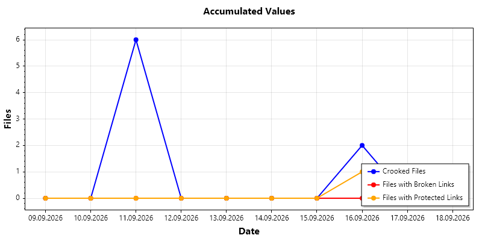

# PdfChecker - Scan Quality Analyzer

## Description
`PdfChecker` is a console application that analyzes scanned PDF documents for quality defects. Every page of every PDF in a configurable input directory is rendered and checked for skew (crooked scan), resolution, sharpness and blank pages. The results are written to a CSV report, aggregated per day and visualized as a chart and an HTML report.

## Purpose
This tool supports scan quality audits by:
- Locating PDF files in an input directory, filtered by a configurable date range
- Rendering every page with PDFium
- Measuring the scan skew angle, the scan resolution (DPI), the sharpness and the ink coverage
- Flagging crooked, blurry, blank and non-analyzable pages
- Writing a per-page CSV report plus a daily aggregation (CSV, PNG chart, HTML report)

## Technology
- **PDF rendering**: [bblanchon.PDFium](https://www.nuget.org/packages/bblanchon.PDFium) native library, accessed via `LibraryImport` P/Invoke (`PdfiumNative.cs`)
- **Image analysis**: [OpenCvSharp5](https://www.nuget.org/packages/OpenCvSharp5) (+ `OpenCvSharp5.runtime.win` for the native binaries)
- **Charting**: [ScottPlot](https://www.nuget.org/packages/ScottPlot) for the PNG chart, Chart.js (CDN) for the HTML report
- **Command line**: [System.CommandLine](https://www.nuget.org/packages/System.CommandLine) for option parsing, validation and the English help output

## How It Works

### Input
- Processes `*.pdf` files from the input directory passed via `--input`
- Scans recursively through all subdirectories
- Only files whose **last write time** falls into the date range passed via `--start`/`--end` are analyzed (both bounds inclusive, full days); if the range is omitted, all PDF files are analyzed

### Processing
1. **Validation**: Verifies the input directory exists and creates the output directory if needed
2. **File Discovery**: Enumerates all `*.pdf` files recursively and filters them by last write time
3. **Page Rendering**: Each page is rendered with PDFium at 150 DPI into a BGRA bitmap and wrapped into an OpenCV `Mat`
4. **Blank Page Detection**: Grayscale -> fixed threshold (gray value < 200 = content) -> share of content pixels. Below 0.1 % the page is reported as `Blank page`
5. **Skew Detection**:
   - Grayscale -> Otsu binarization (content becomes white)
   - Morphological closing with a horizontal kernel (25x3) merges the characters of a text line / the bars of a barcode into blobs
   - `MinAreaRect` per blob, restricted to sufficiently large and clearly elongated blobs (aspect ratio >= 4)
   - Angles normalized to +/-45 degrees, limited to +/-30 degrees, length-weighted median = skew angle
6. **Resolution Detection**: The largest image object of the page (`FPDFImageObj_GetImageMetadata`) provides the horizontal/vertical DPI; the average is reported. Pages without image objects (digitally created text/vector pages) have no scan resolution
7. **Sharpness Detection**: Variance of the Laplacian of the grayscale page - blurry scans contain few strong intensity changes and therefore produce a low variance
8. **Error Handling**: PDFs that cannot be opened or pages that cannot be rendered are reported and skipped, processing continues. A locked report file (e.g. open in Excel) produces a readable message instead of a crash

### Classification
| Measure | Thresholds | Result |
|---|---|---|
| Skew angle | <= 0.3 / <= 1.0 / > 1.0 degrees | `OK` / `Slightly crooked` / `Crooked` |
| Sharpness (Laplacian variance) | < 100 / < 300 / >= 300 | `Blurry` / `Slightly blurry` / `Sharp` |
| Ink coverage | < 0.1 % | `Blank page` |
| No angle determinable | - | `Not analyzable` |

A file counts as defective for the daily statistics as soon as **at least one** of its pages is crooked.

### Output
1. **Per-Page Report** (`analysis_YYYYMMDD_YYYYMMDD.csv`)
   - Columns: `File;Date;Page;Orientation;BlankPage;Deviation;Dpi;Sharpness;SharpnessRating;Links;BrokenLinks;ProtectedLinks`
   - One line per analyzed page, sorted by file, date and page number

2. **Daily Analysis** (`daily_analysis_YYYYMMDD_YYYYMMDD.csv`)
   - Columns: `Date;CrookedFiles;FilesWithBrokenLinks;FilesWithProtectedLinks`
   - `CrookedFiles`: number of files of that day with at least one crooked page
   - `FilesWithBrokenLinks`: number of files of that day with at least one broken web link
   - `FilesWithProtectedLinks`: number of files of that day with at least one protected web link (HTTP 401/403)
   - Days without occurrences are included with count `0`

3. **Chart** (`daily_analysis_YYYYMMDD_YYYYMMDD.png`)
   - Line chart of the daily counts, rendered with ScottPlot (800x400)
   - Three series with a legend: crooked files (blue), files with broken links (red) and files with protected links (orange)

4. **HTML Report** (`daily_analysis_YYYYMMDD_YYYYMMDD.html`)
   - Interactive Chart.js line chart with all three series plus a data table containing all counts

5. **Console Output**
   - Per page: file name, page number, orientation, blank page flag, deviation, resolution, sharpness
   - Paths of the generated report files

## Configuration

### Command-Line Options
All configuration is passed at startup; there are no hardcoded paths or dates.

| Option | Alias | Required | Description |
| --- | --- | --- | --- |
| `--input` | `-i` | yes | Directory that is searched recursively for PDF files. Must exist. |
| `--output` | `-o` | yes | Directory the reports are written to. It is created if it does not exist. |
| `--start` | `-s` | no | Inclusive start of the last write time range. |
| `--end` | `-e` | no | Inclusive end of the last write time range. |
| `--help` | `-h`, `-?` | no | Shows the English help text. |

Dates are parsed using the **current culture** (e.g. `01.01.2024` with a German culture, `01/01/2024` with an English one).

If `--start` and/or `--end` are omitted, the missing bound is derived from the oldest/newest last write date of the matching PDF files, so the daily report never spans an unreasonably large period.

### Exit Codes
- `0`: analysis completed
- `1`: no arguments (help is printed), invalid or missing options, `--start` later than `--end`, missing input directory, or the output directory could not be created

### Optional Settings
- **Analysis** / **AnalysisExtension**: Base name and extension of the per-page report
- **PdfExtension**: File extension of the analyzed documents (default `.pdf`)

### Tuning (in `SkewDetector.cs`)
- **StraightThresholdDegrees** (0.3) / **SlightlySkewedThresholdDegrees** (1.0): skew classification
- **MaxDetectableSkewDegrees** (30.0): angles above this value are treated as unrelated structures
- **BlurryThreshold** (100) / **AcceptableSharpnessThreshold** (300): sharpness classification
- **BlankPageInkCoverage** (0.001) / **InkGrayThreshold** (200): blank page detection
- **RenderDpi** (150): rendering resolution - higher values increase accuracy and runtime

## Usage

1. Build the solution in Visual Studio 2026
2. Show the help text:
   ```
   dotnet run --project PdfChecker -- --help
   ```
3. Run the analysis with an explicit date range:
   ```
   dotnet run --project PdfChecker -- -i C:\Path\To\Pdf\Files -o C:\Path\To\Output -s 01.09.2026 -e 11.09.2026
   ```
4. Or analyze all PDF files without a date filter:
   ```
   dotnet run --project PdfChecker -- -i C:\Path\To\Pdf\Files -o C:\Path\To\Output
   ```
5. Review the generated CSV reports, the PNG chart and the HTML report in the output directory

## Output Example

Per-page report:
```
File;Date;Page;Orientation;BlankPage;Deviation;Dpi;Sharpness;SharpnessRating
Text_OK.pdf;2026-09-11;1;OK;no;0,0;300;3301;Sharp
Text_NG.pdf;2026-09-11;1;Crooked;no;18,1;300;3340;Sharp
TextNew_PictureEmpty.pdf;2026-09-11;2;Blank page;yes;;;0;Blank page
```

Daily analysis:
```
Date;CrookedFiles;FilesWithBrokenLinks;FilesWithProtectedLinks
09.09.2026;0;0;0
10.09.2026;0;0;0
11.09.2026;6;0;0
12.09.2026;0;0;0
...
16.09.2026;2;0;1
```

Chart:



The blue curve shows the number of files with at least one crooked page, the red curve the files with at least one broken web link and the orange curve the files with at least one protected web link. The y-axis uses whole numbers only, because each value counts files.

## Requirements
- .NET 10
- Visual Studio 2026 or later
- Windows x64/x86/arm64 (the native PDFium and OpenCV binaries are supplied by the NuGet runtime packages)
- `AllowUnsafeBlocks` enabled (required by the `LibraryImport` source generator)
- Read access to the PDF files, write access to the output directory
- Internet access when opening the HTML report (Chart.js is loaded from a CDN)

## Notes
- The sharpness value is not an absolute measure: it depends on the render DPI and on the page content (much text = higher variance). Calibrate the thresholds against representative samples
- Real scans are rarely perfectly white (dust, noise, punch holes); increase `BlankPageInkCoverage` if blank pages are missed
- The scan resolution can only be determined for pages that contain image objects
- Existing report files with the same name are overwritten; if a report file is locked by another program, a message is shown and processing continues
- The application is designed for internal development/support use
